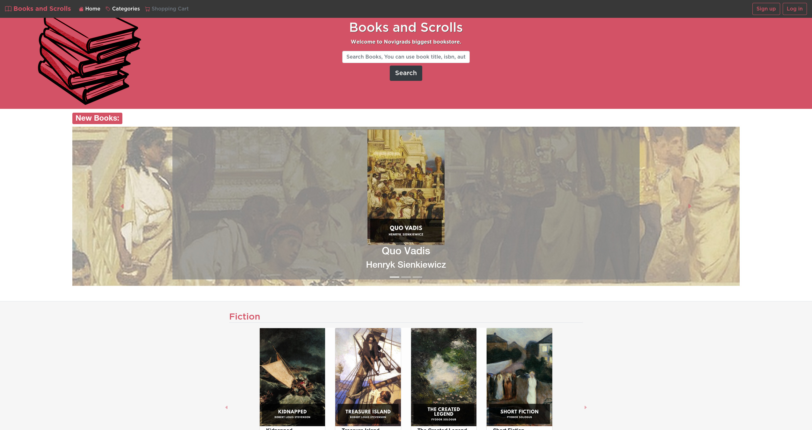

# Books and Scrolls Bookshop Online store

> This project made as Microverse HTML/CSS capstone project.

## Built With

- HTML
- CSS
- Bootstrap
- Flag Sprites Css

## Live Demo

[Live Demo Link](https://sinansevgi.github.io/capstonestore/)

## Getting Started

**Download the .zip file and extract it.**
**Open the index.html file with your browser.**

## Authors

👤 **Sinan Sevgi**

- GitHub: [@sinansevgi](https://github.com/sinansevgi)
- LinkedIn: [@sinansevgi](https://www.linkedin.com/in/sinan-s-52559437/)
- Twitter: [@nativeofcyber1](https://twitter.com/nativeofcyber1)

## 🤝 Contributing

Contributions, issues, and feature requests are welcome!

Feel free to check the [issues page](issues/).

## Show your support

Give a ⭐️ if you like this project!

## Acknowledgments

- Design concept belongs to [Mohammed Awad](https://www.behance.net/gallery/24796463/ZATTIX).
- All book covers taken from [Standard E-books](https://standardebooks.org/).

## 📝 License

This project is  licensed.
